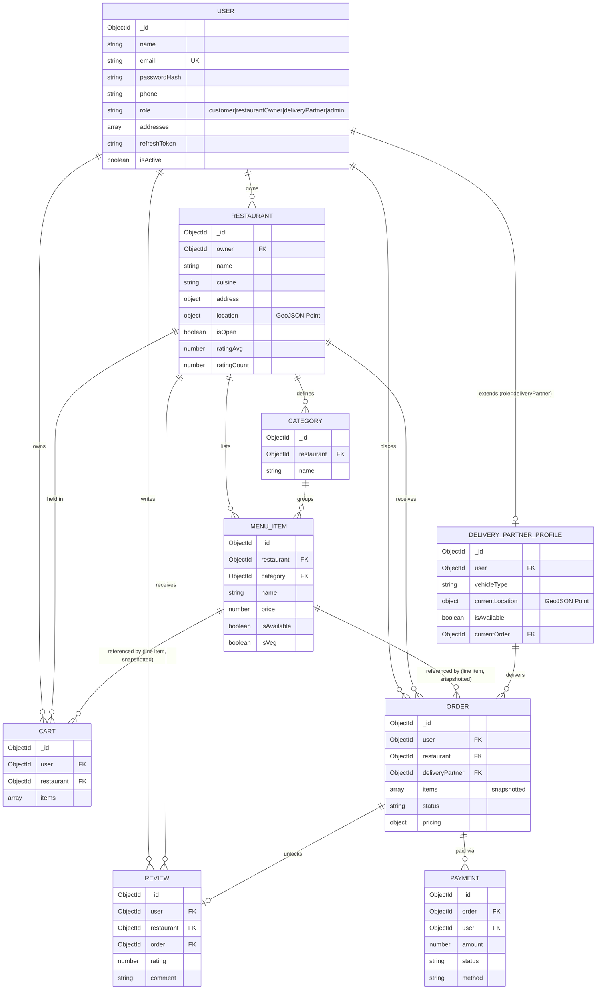

# Online Food Ordering & Restaurant Management System — Architecture

Status: **Full stack, fully integrated, production-reviewed.** Every module below is implemented
end-to-end across all four roles (Customer, Restaurant Owner, Delivery Partner, Admin) — backend
services, controllers, validators, RBAC, pagination/search/sort, Swagger docs, an 84-test Jest +
Supertest integration suite, and a React 19 + Vite frontend (47 Vitest + React Testing Library
tests) wired to every endpoint, plus notifications, a mock payment gateway, and full Docker
Compose orchestration verified with real container builds and health checks. See the root
[README.md](./README.md) for installation, environment setup, and deployment instructions.

---

## 1. Monorepo Folder Structure

```
foof_p/
├── ARCHITECTURE.md
├── backend/
│   ├── src/
│   │   ├── config/
│   │   │   ├── env.js                # validated env vars (single source of truth)
│   │   │   ├── db.js                 # Mongoose connection + graceful shutdown
│   │   │   ├── logger.js             # Winston logger (+ Morgan stream)
│   │   │   └── swagger.js            # swagger-jsdoc spec + swagger-ui mount
│   │   ├── constants/
│   │   │   ├── roles.js              # ROLES enum (customer, restaurantOwner, deliveryPartner, admin)
│   │   │   ├── orderStatus.js        # ORDER_STATUS / PAYMENT_STATUS enums
│   │   │   ├── pricing.js            # tax rate / delivery fee constants
│   │   │   └── notification.js       # NOTIFICATION_TYPE enum
│   │   ├── models/
│   │   │   ├── shared/
│   │   │   │   └── address.schema.js # reusable address sub-schema factory (user + restaurant)
│   │   │   ├── user.model.js
│   │   │   ├── restaurant.model.js
│   │   │   ├── category.model.js
│   │   │   ├── menuItem.model.js
│   │   │   ├── cart.model.js
│   │   │   ├── order.model.js
│   │   │   ├── payment.model.js
│   │   │   ├── review.model.js
│   │   │   ├── notification.model.js
│   │   │   └── deliveryPartnerProfile.model.js
│   │   ├── middlewares/
│   │   │   ├── auth.middleware.js       # JWT verification, req.user
│   │   │   ├── role.middleware.js       # RBAC guard: authorize(...roles)
│   │   │   ├── ownership.middleware.js  # pre-upload ownership checks (before multer touches disk)
│   │   │   ├── upload.middleware.js     # multer disk storage, mimetype/size limits
│   │   │   ├── validate.middleware.js   # Zod schema validation (body/query/params)
│   │   │   ├── rateLimiter.middleware.js
│   │   │   ├── notFound.middleware.js
│   │   │   └── errorHandler.middleware.js # global exception handler
│   │   ├── utils/
│   │   │   ├── ApiError.js
│   │   │   ├── ApiResponse.js
│   │   │   ├── asyncHandler.js
│   │   │   ├── paginate.js
│   │   │   ├── tokens.js              # sign/verify access + refresh tokens (HS256, pinned algorithm)
│   │   │   ├── orderStateMachine.js   # assertTransition — status graph per role
│   │   │   ├── orderPricing.js        # pure subtotal/tax/fee/total calculation
│   │   │   └── mockPaymentGateway.js  # simulated charge: instant paid/failed, COD pending
│   │   ├── validations/
│   │   │   ├── common.validation.js
│   │   │   ├── auth.validation.js
│   │   │   ├── user.validation.js
│   │   │   ├── restaurant.validation.js
│   │   │   ├── category.validation.js
│   │   │   ├── menuItem.validation.js
│   │   │   ├── cart.validation.js
│   │   │   ├── order.validation.js
│   │   │   ├── review.validation.js
│   │   │   ├── delivery.validation.js
│   │   │   └── admin.validation.js
│   │   ├── services/                  # business logic + authorization-on-resource rules
│   │   │   ├── user.service.js
│   │   │   ├── restaurant.service.js
│   │   │   ├── category.service.js
│   │   │   ├── menuItem.service.js
│   │   │   ├── cart.service.js
│   │   │   ├── order.service.js       # checkout, status state machine, delivery transitions
│   │   │   ├── payment.service.js
│   │   │   ├── review.service.js
│   │   │   ├── delivery.service.js    # partner profile/availability/location
│   │   │   ├── notification.service.js
│   │   │   └── admin.service.js
│   │   ├── controllers/               # thin: parse req -> call service -> shape ApiResponse
│   │   │   ├── health.controller.js
│   │   │   ├── auth.controller.js
│   │   │   ├── user.controller.js
│   │   │   ├── restaurant.controller.js
│   │   │   ├── category.controller.js
│   │   │   ├── menuItem.controller.js
│   │   │   ├── cart.controller.js
│   │   │   ├── order.controller.js
│   │   │   ├── payment.controller.js
│   │   │   ├── review.controller.js
│   │   │   ├── delivery.controller.js
│   │   │   ├── notification.controller.js
│   │   │   └── admin.controller.js
│   │   ├── routes/
│   │   │   ├── index.js               # mounts all /api/v1/* routers
│   │   │   ├── auth.routes.js
│   │   │   ├── user.routes.js
│   │   │   ├── restaurant.routes.js
│   │   │   ├── category.routes.js
│   │   │   ├── menu.routes.js
│   │   │   ├── cart.routes.js
│   │   │   ├── order.routes.js
│   │   │   ├── payment.routes.js
│   │   │   ├── review.routes.js
│   │   │   ├── delivery.routes.js
│   │   │   ├── notification.routes.js
│   │   │   └── admin.routes.js
│   │   ├── app.js                     # express app: middleware pipeline + routes
│   │   └── server.js                  # http server bootstrap + DB connect + graceful shutdown
│   ├── scripts/
│   │   └── seedAdmin.js               # one-time bootstrap for the first admin account
│   ├── tests/
│   │   ├── fixtures/                  # sample upload file(s) used by multer tests
│   │   ├── helpers/
│   │   │   ├── auth.js                # registerUser/createAdmin/authHeader test helpers
│   │   │   └── fixtures.js            # restaurant/category/menu-item factory helpers
│   │   ├── unit/
│   │   │   ├── utils.test.js
│   │   │   ├── orderPricing.test.js
│   │   │   ├── mockPaymentGateway.test.js
│   │   │   └── orderStateMachine.test.js
│   │   ├── integration/                 # one file per resource — 84 tests total
│   │   │   ├── health.test.js
│   │   │   ├── auth.test.js
│   │   │   ├── user.test.js
│   │   │   ├── restaurant.test.js
│   │   │   ├── menu.test.js
│   │   │   ├── cart.test.js
│   │   │   ├── orderLifecycle.test.js   # cart -> checkout -> owner updates -> delivery -> review, across roles
│   │   │   ├── payment.test.js
│   │   │   ├── delivery.test.js         # includes concurrent-accept race-condition tests
│   │   │   ├── notification.test.js
│   │   │   └── admin.test.js
│   │   └── setup.js
│   ├── logs/                          # winston file transport backup (gitignored; stdout is primary)
│   ├── uploads/                       # multer disk storage (gitignored)
│   ├── .env.example
│   ├── .eslintrc.json
│   ├── .gitignore
│   ├── .dockerignore
│   ├── Dockerfile
│   ├── docker-compose.yml             # backend + mongo only, for API-only development
│   ├── jest.config.js
│   └── package.json
└── frontend/                          # React 19 + Vite SPA, Tailwind CSS v4, Redux Toolkit
    ├── src/
    │   ├── api/                       # one axios-wrapped module per backend resource
    │   ├── app/                       # Redux store + typed hooks
    │   ├── components/
    │   │   ├── ui/                    # hand-rolled design system (Button, Input, Modal, ...)
    │   │   ├── layout/                # Navbar, DashboardLayout, role-specific shells
    │   │   ├── common/                # AddressForm, NotificationBell, PageTransition, ...
    │   │   ├── cart/, order/, restaurant/  # feature-specific presentational components
    │   ├── features/                  # Redux slices: auth, cart, ui (+ per-role feature folders)
    │   ├── hooks/                     # useFetch, useToast, ...
    │   ├── pages/
    │   │   ├── public/                # Landing, Login, Signup, NotFound, Unauthorized
    │   │   ├── customer/              # RestaurantListing, FoodSearch, Cart, Checkout, OrderTracking, ...
    │   │   ├── restaurantOwner/       # Dashboard, ManageRestaurant, ManageMenu, Orders, Analytics
    │   │   ├── delivery/              # AssignedOrders, DeliveryTracking, History
    │   │   └── admin/                 # Dashboard, Users, Restaurants, Orders, DeliveryPartners, Analytics
    │   ├── routes/                    # ProtectedRoute / RoleRoute guards
    │   ├── test/setup.js              # Vitest + jest-dom setup
    │   └── utils/                     # format.js, constants.js
    ├── Dockerfile                     # multi-stage: vite build -> nginx-unprivileged
    ├── nginx.conf
    └── package.json
```

### Folder explanation

| Folder | Responsibility |
|---|---|
| `config/` | Anything that reads `process.env` or wires a third-party client lives here exactly once. Nothing outside `config/` should touch `process.env` directly. |
| `constants/` | Shared enums so magic strings (`"admin"`, `"delivered"`) never get typo'd across files. |
| `models/` | Mongoose schemas + statics/methods. No business logic beyond model-level invariants (hashing, virtuals). |
| `middlewares/` | Cross-cutting request pipeline concerns: auth, RBAC, validation, rate limiting, error translation. |
| `utils/` | Pure, stateless helpers reused across controllers (errors, pagination, token signing). |
| `validations/` | Zod schemas describing the *shape* of acceptable input per route. Consumed by `validate.middleware.js`. |
| `services/` | All business logic: state transitions, pricing, resource-ownership checks (e.g. "does this restaurant belong to this owner?"), cross-collection orchestration (checkout touching Cart + Order + Payment). Talks to Mongoose models directly. |
| `controllers/` | Thin request/response glue: parse `req`, call one service function, wrap the result in `ApiResponse`/throw `ApiError`. No business logic lives here. |
| `routes/` | Wires `path -> [auth, RBAC, validation middleware] -> controller`. No logic. |
| `tests/` | `unit/` tests pure functions in isolation (pricing math, the order state machine); `integration/` boots the Express app against an in-memory Mongo instance via Supertest and drives real multi-role flows. |
| `scripts/` | One-off operational scripts run outside the request/response cycle (currently just `seedAdmin.js`, since admin accounts can't be created through the public API). |

This is a **layered architecture** (routes → middleware → controllers → services → models), not a
feature-sliced one, because the four roles share the same underlying resources (orders, menu
items) with differing permissions rather than owning separate subsystems — RBAC middleware is a
cheaper way to express that than duplicating modules per role.

**On repositories:** a separate repository layer between services and Mongoose models was
deliberately skipped. Mongoose models already *are* the data-access layer (query building,
schema validation, indexes); a repository that only proxied `Model.find()`/`Model.create()` with
no added logic would be pure ceremony. Where query logic is genuinely reused across services
(ownership assertions, restaurant search), it's factored into a named function exported from the
owning service (e.g. `restaurant.service.js` exports `assertOwnerOrAdmin`, reused by
`category.service.js` and `menuItem.service.js`) rather than a generic repository class.

---

## 2. Database Design (MongoDB, normalized where relationships are queried independently)

| Collection | Purpose | Normalization notes |
|---|---|---|
| `users` | Single collection for all 4 roles (`customer`, `restaurantOwner`, `deliveryPartner`, `admin`), discriminated by `role`. Embeds `addresses[]` (owned 1:1 by the user, never queried standalone). | Avoids a 4-table auth split; role-specific *extended* profile data (vehicle info) lives in its own collection since it has a different lifecycle and is only relevant to one role. |
| `restaurants` | One document per restaurant. References `owner` (User). Embeds opening hours & geo location (`GeoJSON Point`) for `$geoNear` queries. | Not embedded in `users` — restaurants are queried/searched/sorted independently of their owner far more often than joined with it. |
| `categories` | Menu categories scoped to a restaurant (e.g. "Starters"). | Kept separate from `menuItems` so a restaurant's category list can be fetched without pulling every item. |
| `menuItems` | Dish documents, referencing `restaurant` + `category`. | Normalized (not embedded in `restaurants`) because menu items are paginated/searched/sorted independently and a restaurant can have hundreds of items — embedding would blow past MongoDB's practical document-growth comfort zone. |
| `carts` | One active cart per `(user, restaurant)` pair. Line items reference `menuItem` but snapshot `name`/`price` at add-time. | Kept as its own collection (not embedded in `users`) since carts churn constantly and shouldn't bloat the user document. |
| `orders` | Immutable snapshot of a placed order: line items, pricing breakdown, status history, refs to `user`, `restaurant`, `deliveryPartner`. | Line items are embedded (denormalized) *by design* — an order must remain historically accurate even if the menu item's price/name later changes. |
| `payments` | One document per payment attempt against an order (supports retries). | Separate from `orders` so payment gateway webhooks can update payment state without touching the order document, and refund history isn't cluttering the order. |
| `reviews` | Customer review of a restaurant, optionally tied to the `order` that unlocked it. | Separate collection so restaurant rating aggregation queries don't compete with order traffic. |
| `deliveryPartnerProfiles` | Extended profile for `deliveryPartner` role users: vehicle info, live location, availability, current order. | Split from `users` because it's high-write (location pings) and only exists for one role — keeping it off the `users` document avoids unrelated writes contending on the same doc. |

### Collection relationships

```
users (1) ──< restaurants (owner)              [1 owner : many restaurants]
users (1) ──< deliveryPartnerProfiles (user)    [1:1]
users (1) ──< carts (user)                      [1 : many, one active per restaurant]
users (1) ──< orders (user)                     [1 : many]
users (1) ──< reviews (user)                    [1 : many]

restaurants (1) ──< categories (restaurant)     [1 : many]
restaurants (1) ──< menuItems (restaurant)      [1 : many]
restaurants (1) ──< carts (restaurant)          [1 : many]
restaurants (1) ──< orders (restaurant)         [1 : many]
restaurants (1) ──< reviews (restaurant)        [1 : many]

categories (1) ──< menuItems (category)         [1 : many]

orders (1) ──< payments (order)                 [1 : many, retries]
orders (1) ──  reviews (order, optional)        [1 : 0..1]
orders (1) ──  deliveryPartnerProfiles           [assigned via deliveryPartner ref + currentOrder]
```

### ER Diagram



---

## 3. Mongoose Models

Implemented in `backend/src/models/*.model.js`. Highlights:

- Every schema uses `{ timestamps: true }` for `createdAt`/`updatedAt`.
- Geo fields (`restaurants.location`, `deliveryPartnerProfiles.currentLocation`) use a `2dsphere`
  index for proximity search (`$near`, "restaurants near me").
- `users.email` and `(restaurants.owner)` etc. carry indexes matching actual query patterns
  (see index annotations in each model file).
- `user.model.js` hashes passwords with bcrypt in a `pre('save')` hook and exposes
  `comparePassword()`; the password field is `select: false` by default.
- `order.model.js` embeds a `statusHistory[]` subdocument array so state transitions are
  auditable without a separate collection.

---

## 4. API Structure

Base path: `/api/v1`. All list endpoints support **pagination** (`page`, `limit`), **search**
(`q` on indexed text fields), and **sorting** (`sortBy=field:asc|desc`) via the shared
`paginate()` util and `common.validation.js` query schema.

All endpoints below are fully implemented.

| Resource | Method | Path | Roles |
|---|---|---|---|
| Auth | POST | `/auth/register`, `/auth/login`, `/auth/refresh-token` | public |
| Auth | POST `/auth/logout`, GET `/auth/me` | authenticated |
| Users | GET/PATCH | `/users/:id` | self, admin |
| Users | POST/PATCH/DELETE | `/users/me/addresses[/:addressId]` | authenticated (own address book) |
| Restaurants | GET | `/restaurants` (search `q`, filter `cuisine`/`city`/`isOpen`, sort, paginate, geo via `lat`/`lng`/`radiusKm`) | public |
| Restaurants | GET | `/restaurants/mine` (owner's own restaurants, incl. unapproved — dashboard use) | restaurantOwner, admin |
| Restaurants | GET | `/restaurants/:id`, `/restaurants/:id/menu` | public |
| Restaurants | POST/PATCH/DELETE | `/restaurants[/:id]` | restaurantOwner, admin |
| Restaurants | PATCH | `/restaurants/:id/images` (multer: logo + cover) | owner, admin |
| Restaurants | GET | `/restaurants/:id/dashboard` (orders by status, revenue, top items, rating) | owner, admin |
| Categories | GET | `/categories?restaurant=:id` | public |
| Categories | POST/PATCH/DELETE | `/categories[/:id]` | owner, admin |
| Menu Items | GET | `/menu-items` (search `q`, filter `restaurant`/`category`/`isVeg`/price range, sort, paginate) | public |
| Menu Items | GET | `/menu-items/:id` | public |
| Menu Items | POST/PATCH/DELETE | `/menu-items[/:id]` | owner, admin |
| Menu Items | PATCH | `/menu-items/:id/image` (multer) | owner, admin |
| Cart | GET/DELETE | `/cart` | customer |
| Cart | POST/PATCH/DELETE | `/cart/items[/:itemId]` | customer |
| Orders | POST | `/orders` (checkout: cart → order + payment) | customer |
| Orders | GET | `/orders`, `/orders/:id` (role-scoped: own / own-restaurant / assigned / all) | customer, owner, deliveryPartner, admin |
| Orders | PATCH | `/orders/:id/status` (confirm/prepare/ready/cancel) | restaurantOwner, admin |
| Payments | GET | `/payments/:id` | order owner, admin |
| Reviews | GET | `/reviews?restaurant=:id` | public |
| Reviews | POST | `/reviews` (delivered orders only, one per order) | customer |
| Delivery | GET/PATCH | `/delivery/profile`, `/delivery/availability`, `/delivery/location` | deliveryPartner |
| Delivery | GET | `/delivery/orders/available`, `/delivery/orders/assigned`, `/delivery/orders/history` | deliveryPartner |
| Delivery | PATCH | `/delivery/orders/:id/accept`, `/picked-up`, `/out-for-delivery`, `/delivered` | deliveryPartner |
| Admin | GET | `/admin/dashboard` (platform analytics) | admin |
| Admin | GET/PATCH | `/admin/users`, `/admin/users/:id/status` | admin |
| Admin | GET/PATCH | `/admin/restaurants`, `/admin/restaurants/:id/approve` | admin |
| Admin | GET | `/admin/delivery-partners` | admin |
| Notifications | GET | `/notifications` (paginated, `meta.unreadCount`) | authenticated |
| Notifications | PATCH | `/notifications/:id/read`, `/notifications/read-all` | authenticated |
| Docs | GET | `/docs` | public (Swagger UI) |
| Health | GET | `/health` | public |

"Manage Foods"/"Manage Orders" for admin reuse the same menu-item and order endpoints above —
admin is granted a bypass in each service's ownership check (`assertOwnerOrAdmin`,
`assertOrderAccess`) rather than duplicating separate `/admin/*` CRUD routes for resources that
already support role-based access.

There is deliberately no `POST /auth/register` path to the `admin` role (see §6) — the first
admin account is created with `backend/scripts/seedAdmin.js`, documented in the root README.

---

## 5. Middleware Architecture (request pipeline order)

```
Request
  → helmet                      (secure headers)
  → cors                        (origin allow-list from env)
  → compression                 (gzip responses)
  → express.json / urlencoded   (body parsing, size-limited)
  → morgan → winston stream     (HTTP access log)
  → rateLimiter                 (per-IP, stricter on /auth/*)
  → routes/index.js
      → validate(schema)        (per-route Zod validation, 400 on failure)
      → authenticate             (JWT verify, attaches req.user, 401 on failure)
      → authorize(...roles)      (RBAC, 403 on failure)
      → controller                (asyncHandler-wrapped)
  → notFound                    (404 for unmatched routes)
  → errorHandler                (single place that shapes every error response)
```

`errorHandler` normalizes: Mongoose `CastError`/`ValidationError`/duplicate-key `11000`, JWT
errors, Zod errors, and our own `ApiError`, into one consistent envelope
`{ success: false, message, errors?, stack? (dev only) }`. Every uncaught async error reaches it
because controllers are wrapped in `asyncHandler`.

---

## 6. Authentication Strategy

- **JWT access token** (short-lived, 15m default) signed with `JWT_ACCESS_SECRET`, sent in the
  response body and expected in `Authorization: Bearer <token>`.
- **JWT refresh token** (long-lived, 7d default) signed with a *different* secret
  (`JWT_REFRESH_SECRET`), stored hashed on the `users` document and set as an `httpOnly`,
  `sameSite=strict` cookie — never exposed to JS, mitigating XSS token theft.
- `POST /auth/refresh-token` rotates the refresh token (old one is invalidated on use) to limit
  replay-attack windows.
- Passwords hashed with `bcrypt` (cost factor from env, default 10) in a model-level pre-save
  hook; the hash is never selected by default queries.
- **RBAC**: `role` is embedded in the access-token payload; `authorize('admin', 'restaurantOwner')`
  middleware checks `req.user.role` against an allow-list per route. Resource-level ownership
  checks (e.g. "this restaurant belongs to this owner") happen in the **service layer**
  (`assertOwnerOrAdmin`, `assertOrderAccess`, `assertRestaurantOwnership`), since those require a
  DB lookup that RBAC middleware — which only inspects the JWT payload — shouldn't own.

---

## 7. Order & Delivery State Machine

Enforced by `utils/orderStateMachine.js` (`assertTransition`), unit-tested in isolation:

```
placed → confirmed → preparing → readyForPickup → assigned → pickedUp → outForDelivery → delivered
   └──────────┴───────────┴────────────┘ (restaurantOwner/admin may cancel from any of these)
```

- **restaurantOwner** (must own the restaurant): `placed→confirmed→preparing→readyForPickup`,
  and may cancel from any pre-pickup state.
- **deliveryPartner**: `readyForPickup→assigned` is a *self-assignment* (`PATCH
  /delivery/orders/:id/accept`, fails with 409 if another partner already claimed it), then
  `assigned→pickedUp→outForDelivery→delivered`, each requiring the caller to be the assigned
  partner. Marking `delivered` also flips a pending Cash-on-Delivery payment to `paid`.
- **admin**: bypasses the transition table entirely (any transition from any non-terminal state)
  but is still blocked once an order is `delivered`/`cancelled`.
- Every transition appends to `order.statusHistory[]`, which is what `GET /orders/:id` (Track
  Orders) returns to the customer.

**Pricing** (`utils/orderPricing.js`, pure/unit-tested): `subtotal` = Σ(item price + add-ons) ×
quantity; `tax` = 5% of subtotal; `deliveryFee` is a flat platform-configured constant (no
distance-based calculation in this phase — noted as a simplification); `total` = subtotal + tax +
deliveryFee − discount. Orders below the restaurant's `minOrderAmount` are rejected at checkout.

---

## 8. What's intentionally deferred

Deliberately out of scope, as simplifications rather than oversights: a *real* payment gateway
integration (payments are simulated by `utils/mockPaymentGateway.js` — instant "paid" or a
simulated decline for card/UPI/wallet, "pending" until delivery for COD), distance-based delivery
pricing, a coupon/discount engine (the `pricing.discount` field exists on the Order model for
forward-compatibility but nothing currently populates it), and push/email/SMS delivery for
notifications (they're in-app only, stored in the `notifications` collection and polled by the
frontend — no external notification service is wired up).
