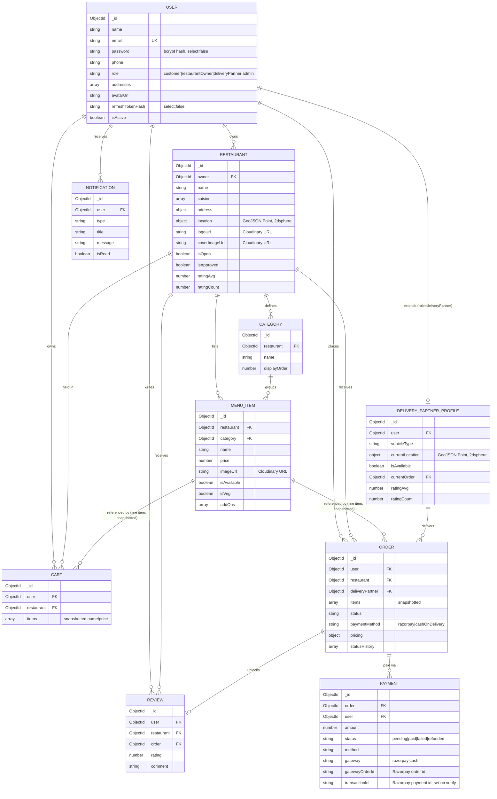

# Entity-Relationship Diagram

Renders natively on GitHub. See [DATABASE_SCHEMA.md](./DATABASE_SCHEMA.md) for the normalization
rationale behind these relationships (which are embedded vs. referenced, and why).

